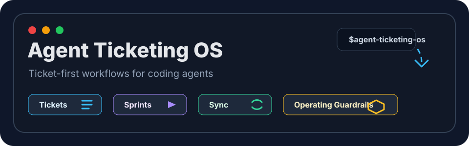

<p align="center">
  
</p>

<p align="center">
  <strong>Ticket-first workflows for coding agents.</strong>
</p>

<p align="center">
  <a href="https://github.com/dwightpeaster/agent-ticketing-os"></a>
  <a href="https://github.com/dwightpeaster/agent-ticketing-os"></a>
  <a href="https://github.com/dwightpeaster/agent-ticketing-os/blob/main/plugins/agent-ticketing-os/.codex-plugin/plugin.json"></a>
</p>

Agent Ticketing OS is a portable workflow system for coding agents. It helps Claude Code, Codex, and other Agent Skills-compatible tools plan work, create tickets, track implementation, run lightweight sprints, and leave an audit trail inside the repo.

The idea is simple: agents should not drift through a codebase. They should create or select a ticket, capture the goal, define acceptance criteria, update status as work moves, and leave enough context for the next human or agent to continue.

## Install With Codex

Add this repository as a Codex plugin marketplace:

```bash
codex plugin marketplace add dwightpeaster/agent-ticketing-os
```

Then install the plugin:

```bash
codex plugin add agent-ticketing-os@agent-ticketing-os
```

Restart Codex after installing.

## Install With Claude Code

Add this repository as a Claude Code plugin marketplace from inside Claude Code:

```text
/plugin marketplace add dwightpeaster/agent-ticketing-os
```

Then install the plugin:

```text
/plugin install agent-ticketing-os@agent-ticketing-os
```

Reload plugins after installing:

```text
/reload-plugins
```

## How It Works

```text
Request -> ticket -> plan -> branch/work -> validation -> handoff
              |        |        |             |
              v        v        v             v
            backlog   sprint   status      audit trail
```

Agent Ticketing OS gives agents a repeatable operating loop:

1. Capture or select the ticket.
2. Clarify the goal and acceptance criteria.
3. Plan the work before implementation.
4. Track status through the board or sprint.
5. Record validation, decisions, and handoff notes.

## First Use

Install the whole system:

```text
$agent-ticketing-os
```

Use only the ticketing layer:

```text
$agent-ticketing-init
```

Use only the operating layer:

```text
$agent-operating-init
```

Use the stricter split-board ticket workflow:

```text
$agent-ticketing-init using the strict profile
```

## What It Does

Agent Ticketing OS has three setup paths:

- **Full OS**: ticketing plus stricter agent workflow guardrails.
- **Ticketing only**: local tickets, backlog, board, sprints, and sync config.
- **Operating only**: branch, commit, PR, QA, review, release, security, and handoff rules on top of an existing ticket workflow.

Once installed, agents can respond to normal requests:

```text
Create a ticket for the login redirect bug.
What should we work on next?
Start a sprint for the dashboard cleanup work.
Move T-0004 to review.
Close T-0004 with the tests we ran.
```

## Skills Included

- `$agent-ticketing-os` - initialize the complete ticketing plus operating system.
- `$agent-ticketing-init` - set up repo-local ticketing.
- `$agent-ticketing-new` - create a ticket from natural language.
- `$agent-ticketing-next` - pick the next best ticket.
- `$agent-ticketing-board` - show or refresh board and backlog state.
- `$agent-ticketing-move` - move tickets between statuses.
- `$agent-ticketing-close` - close or won't-do tickets.
- `$agent-ticketing-sprint` - plan and close lightweight Markdown sprints.
- `$agent-ticketing-sync` - sync with external trackers when tools are available.
- `$agent-operating-init` - set up stricter agent operating mode.
- `$agent-operating-review` - review readiness for tickets, branches, PRs, and handoffs.
- `$agent-ticketing` - broad fallback skill for clients that load only the root skill.

## What Gets Created

Default ticketing setup creates a local ticket system:

```text
.tickets/
  config.json
  REGISTRY.json
  BACKLOG.md
  BOARD.md
  CHANGELOG.md
  DECISIONS.md
  tickets/
  templates/
  reports/current-sprint.md
```

The strict profile also creates human-facing planning files:

```text
tickets.md
docs/tickets/BACKLOG.md
docs/tickets/COMPLETED.md
docs/ROADMAP.md
docs/PRODUCT_DECISIONS.md
```

Agent Operating Mode can add repo workflow docs such as `AGENTS.md`, ticket standards, definition of done, branch workflow, commit workflow, review checklist, QA guide, and handoff templates.

## Design Goals

- Local-first: useful without a hosted service.
- Agent-friendly: natural-language skills plus deterministic file operations.
- Auditable: tickets, decisions, sprints, tests, and handoffs live in git.
- Portable: usable as a Codex plugin package or Agent Skills folder.
- Extensible: external tracker sync can be added through available tools or MCP connectors.
